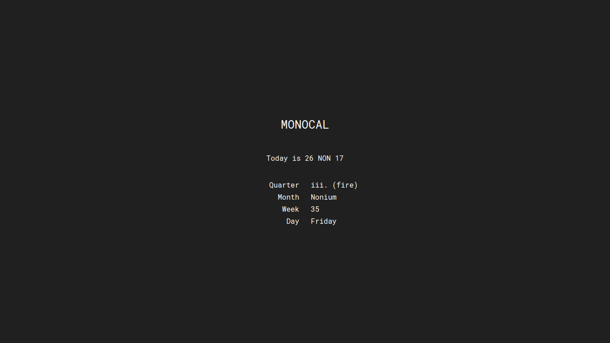

[](https://joshavanier.github.io/monocal/)


**MONOCAL** is [Ian Battaglia](https://twitter.com/IanJBattaglia)'s [calendrical system](https://monochromatic.co/metachromatic/index/2017/1/16/monocal-1?rq=monocal).

## ⌘

To convert a Gregorian date to MONOCAL, pass a `Date` as a parameter. If there is none, today will be used by default

```js
MONO.convert(new Date(1997, 03, 17))
MONO.convert()

MONO.full(m)     // 04 Septium 2017
MONO.short(m)    // 04 SEPT 17
MONO.shorter(m)  // 04SEPT17
MONO.standard(m) // Septium 4th, 2017

MONO.qua() // quarter (i., ii., iii., iv.)
MONO.aqu() // quarter (air, water, fire, earth)
MONO.mon() // month name
MONO.wek() // week number
MONO.dat() // date number
```

---

Ian Battaglia

[](https://github.com/MoreThanLuck) [](https://twitter.com/IanJBattaglia) [](https://monochromatic.co)

Josh Avanier

[](https://twitter.com/joshavanier) [](https://joshavanier.com)
